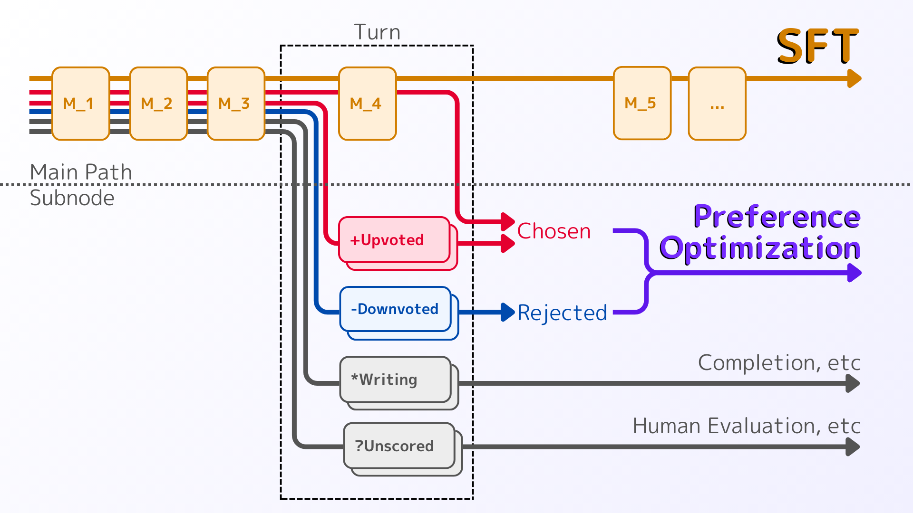

# PlainPreferenceTree
The data format and light syntaxes for creating datasets for supervised fine-tuning (SFT) and policy optimization (PO) of text-generation models such as large-language-models.

# Structure : Preference-Tree
"*Preference-Tree*" is an original graph structure designed to represent text-based conversational data and preference data.



### Components

**Main Node**: The orange nodes $M_1,M_2,\ldots$ are referred to as "*main nodes*".
The main nodes forms a single path, called "*main path*", which represents a conversation history for SFT and PO.
Odd-indexed main node $M_1, M_3, M_5, ...$ correspond to user messages, while even-indexed main node $M_2, M_4, M_6, ...$ correspond to assistant messages.


**Subnode** and **Turn**: Each main node has not only a next main node but also additional nodes called "*subnodes*". 
Subnodes do not have the next node are considered dead-ends.
The main node and its associated subnodes together form "*turn*" in our system.
There are several types of subnodes, each serving a specific role:

* **Upvoted Subnode**: Represents a desired, nice, or preferred message.
Used for *chosen* response in PO.
* **Downvoted Subnode**: Represents a undesired, bad, or not-preferred message.
Used for *rejected* response in PO.
* **Writing Subnode**: Indicates that the message is in the process of being written. 
Expected to be completed, e.g., by an LLM or human to make response candidates.
* **Unscored Subnode**: Indicates that the message is not yet been scored.
Expected to be change to an upvoted or downvoted subnode, typically through human evaluation.

### Data Extraction
**SFT data**: The SFT data is extracted from the Preference-Tree as a sequence of main nodes:
```math
[M_1, M_2, M_3, ...]
```

**PO data**: To construct PO data, we need to prepare the preference pairs, in the form of (prompt, chosen, rejected).
These pairs are also extracted from the Preference-Tree.
For each turn $i$, we consider the set of upvoted subnodes $\mathcal U_i$ and the set of downvoted subnodes $\mathcal D_i$ associated with that turn.
Then, the following preference pairs are constructed:
```math
\begin{cases}
    \mathtt{prompt}  &= [M_1,...,M_{i-1}] \\
    \mathtt{chosen}  &= [C] \\
    \mathtt{rejected}&= [R]
\end{cases}
\quad,~
\forall C \in\mathcal{U}_i \cup \{M_i\} ,~
\forall R \in\mathcal{D}_i .
```
* The main node $M_i$ is also considered a chosen sample in response to the prompt $[M_1,...,M_{i-1}]$.
* The number of preference pairs starting from $M_i$ is $(|\mathcal{U}_i|+1)|\mathcal{D}_i|$.
* Multi-turn chosen and rejected samples are currently not available.

This structure and extraction method facilitate the creation of datasets for both SFT and PO tasks.

# Syntaxes : Plain-Preference-Tree
"*Plain-Preference-Tree*" is a plain-text-based lightweight format for making up the Preference-Tree.

**Signs**
Sign | Meaning
---- | ------
`:`  | Line break
`+`  | Upvoted subnode
`-`  | Downvoted subnode
`*`  | Writing subnode
`?`  | Unscored subnode

**Main Node**: Main nodes a represented by lines starting with no sign. 

Example:
```plaintext
Hello.
Hello. How can I assist today?
I'd like to do something fun!
```
The line 1 and 3 are user messages, and the line 2 is assistant message.

**Line Break**: To add a line-break within a message, the subsequent lines need to start with `:`.

Example:
```plaintext
Hello.
Hello. How can I assist today?
I'd like to do something fun!
:Do you have any recommendations?
```
The 2nd user turn (line 3-4) has 1 line break.

**Subnode**
You can add subnode by adding the corresponding sign at the beginning of the line.
The type of subnode and the corresponding sign is shown in the signs table.
You can also line break `:` at any type of subnode.
The subnodes in the turn are appended after the main node of the turn.

Example:
```plaintext
Hello.
Hello. How can I assist today?
+Hello. I'm glad to see you.
:Here are news.
+Hello! You look happy!
-I'm sleepy. Bye.
*I am a 
?Good morning. What are you planning to do today?
I'd like to do something fun!
:Do you have any recommendations?
```
In the example above, line 2-7 represents the 1st assistant turn.
* Line 2 is the main node of the 1st assistant turn.
* Line 3-8 is the subnodes of the 1st assistant turn.
* Line 3-4 is an upvoted subnode (with a line break).
* Line 5 is another upvoted subnode.
* Line 6 is a downvoted subnode.
* Line 7 is a writing subnode.
* Line 8 is an unscored subnode.

> [!NOTE]
> We have not implemented the escape sequence for main nodes.
> Lines starting with `:`, `+`, `-`, `*` or `?` are not valid main nodes.

# Creating Dataset from Plain-Preference-Tree
First, clone this repository.
```bash
mkdir example
cd example
git clone https://github.com/Mya-Mya/PlainPreferenceTree/
```

And then import the repository.
```python
from PlainPreferenceTree import *
```

Make the Plain-Preference-Tree format text.
```python
ppttext = """Hello.
Hello. How can I assist today?
I'd like to do something fun!
:Do you have any recommendations?
How about walking around in your town?
+How about listening to music?
:It is relaxing to listen to music!
+How about reading books?
-I don't want to answer. Bye
*How about going
?So, you can play with me. Let's play together!
That sounds fun. What should I watch out for when walking?
When walking, it's important to be aware of your surroundings.
"""
```

Launch the parser.
The Preference-Tree is obtained by `loads` method.
```python
parser = PPTParserV1()
pt = parser.loads(ppttext)
```

Result:
```python
[
    Turn(role='user', main='Hello.', subnodes=[]),
    Turn(role='assistant', main='Hello. How can I assist today?', subnodes=[]),
    Turn(role='user', main="I'd like to do something fun!\nDo you have any recommendations?", subnodes=[]),
    Turn(
        role='assistant',
        main='How about walking around in your town?',
        subnodes=[
            Subnode(type='upvoted', content='How about listening to music?\nIt is relaxing to listen to music!'),
            Subnode(type='upvoted', content='How about reading books?'),
            Subnode(type='downvoted', content="I don't want to answer. Bye"),
            Subnode(type='writing', content='How about going'),
            Subnode(type='unrated', content="So, you can play with me. Let's play together!")
        ]
    ),
    Turn(role='user', main='That sounds fun. What should I watch out for when walking?', subnodes=[]),
    Turn(role='assistant', main="When walking, it's important to be aware of your surroundings.", subnodes=[])
]
```

The SFT data is obtained by `make_conversation` method.
```python
sft_data = make_conversation(pt)
```

Result:
```python
[
    {'role': 'user', 'content': 'Hello.'},
    {'role': 'assistant', 'content': 'Hello. How can I assist today?'},
    {'role': 'user', 'content': "I'd like to do something fun!\nDo you have any recommendations?"},
    {'role': 'assistant', 'content': 'How about walking around in your town?'},
    {'role': 'user', 'content': 'That sounds fun. What should I watch out for when walking?'},
    {'role': 'assistant', 'content': "When walking, it's important to be aware of your surroundings."}
]
```

The PO data is obtained by `make_preferences` method.
```python
preferences = make_preferences(pt)
```

Result:
```python
[
    {
        'prompt': [
            {'role': 'user', 'content': 'Hello.'},
            {'role': 'assistant', 'content': 'Hello. How can I assist today?'},
            {'role': 'user', 'content': "I'd like to do something fun!\nDo you have any recommendations?"}
        ],
        'chosen': [
            {'role': 'assistant', 'content': 'How about listening to music?\nIt is relaxing to listen to music!'}
        ],
        'rejected': [{'role': 'assistant', 'content': "I don't want to answer. Bye"}]
    },
    {
        'prompt': [
            {'role': 'user', 'content': 'Hello.'},
            {'role': 'assistant', 'content': 'Hello. How can I assist today?'},
            {'role': 'user', 'content': "I'd like to do something fun!\nDo you have any recommendations?"}
        ],
        'chosen': [{'role': 'assistant', 'content': 'How about reading books?'}],
        'rejected': [{'role': 'assistant', 'content': "I don't want to answer. Bye"}]
    },
    {
        'prompt': [
            {'role': 'user', 'content': 'Hello.'},
            {'role': 'assistant', 'content': 'Hello. How can I assist today?'},
            {'role': 'user', 'content': "I'd like to do something fun!\nDo you have any recommendations?"}
        ],
        'chosen': [{'role': 'assistant', 'content': 'How about walking around in your town?'}],
        'rejected': [{'role': 'assistant', 'content': "I don't want to answer. Bye"}]
    }
]
```