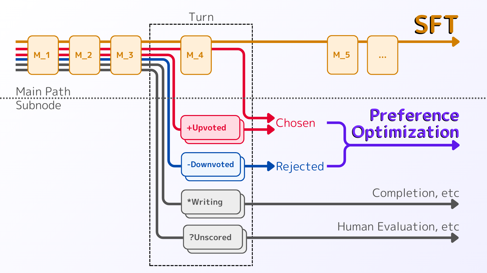

# PlainPreferenceTree

The data format and light syntaxes for creating datasets for supervised fine-tuning (SFT) and policy optimization (PO)
of text-generation models such as large-language-models.

# Structure : Preference-Tree

"*Preference-Tree*" is an original graph structure designed to represent text-based conversational data and preference
data.


### Components

**Main Node**: The orange nodes $M_1,M_2,\ldots$ are referred to as "*main nodes*".
The main nodes forms a single path, called "*main path*", which represents a conversation history for SFT and PO.
The first node represents either user or system message, and the subsequent messages repeat between the user's and the
assistant's.

**Subnode** and **Turn**: Each main node has not only a next main node but also additional nodes called "*subnodes*".
Subnodes do not have the next node are considered dead-ends.
The main node and its associated subnodes together form "*turn*" in our system.
There are several types of subnodes, each serving a specific role:

| Subnode Type | Description                                                                                                                                      |
|--------------|--------------------------------------------------------------------------------------------------------------------------------------------------|
| Upvoted      | A desired, nice, or preferred message. Used for *chosen* response in PO.                                                                         |
| Downvoted    | An undesired, bad, or not-preferred message. Used for *rejected* response in PO.                                                                 |
| Writing      | Indicates that the message is in the process of being written. Expected to be completed, e.g., by an LLM or human to make response candidates.   |
| UnscoredÏ    | Indicates that the message is not yet been scored. Expected to be change to an upvoted or downvoted subnode, typically through human evaluation. |

### Data Extraction

**SFT data**: The SFT data is extracted from the Preference-Tree as a sequence of main nodes:

```math
[M_1, M_2, M_3, ...]
```

**PO data**: To construct PO data, we need to prepare the preference pairs, in the form of (prompt, chosen, rejected).
These pairs are also extracted from the Preference-Tree.
For each turn $i$, we consider the set of upvoted subnodes $\mathcal U_i$ and the set of downvoted
subnodes $\mathcal D_i$ associated with that turn.
Then, the following preference pairs are constructed:

```math
\begin{cases}
    \mathtt{prompt}  &= [M_1,...,M_{i-1}] \\
    \mathtt{chosen}  &= [C] \\
    \mathtt{rejected}&= [R]
\end{cases}
\quad,~
\forall C \in\mathcal{U}_i \cup \{M_i\} ,~
\forall R \in\mathcal{D}_i .
```

* The main node $M_i$ is also considered a chosen sample in response to the prompt $[M_1,...,M_{i-1}]$.
* The number of preference pairs starting from $M_i$ is $(|\mathcal{U}_i|+1)|\mathcal{D}_i|$.
* Multi-turn chosen and rejected samples are currently not available.

This structure and extraction method facilitate the creation of datasets for both SFT and PO tasks.

# Syntaxes : Plain-Preference-Tree

> [!NOTE]
> The syntax described here complies with `PPTParserV2`.

"*Plain-Preference-Tree*" is a plain-text-based lightweight format for making up the Preference-Tree.

**Signs**

| Sign | Meaning           |
|------|-------------------|
| `/`  | System prompt     |
| `:`  | Line break        |
| `+`  | Upvoted subnode   |
| `-`  | Downvoted subnode |
| `*`  | Writing subnode   |
| `?`  | Unscored subnode  |

**Main Node**: Main nodes a represented by lines starting with no sign.

> [!NOTE]
> We have not implemented the escape sequence for main nodes.
> Lines starting with `:`, `+`, `-`, `*` or `?` are not valid main nodes.

**Example**: The examples are in `Examples` directory.

# Creating Dataset from Plain-Preference-Tree

First, clone this repository.

```bash
mkdir example
cd example
git clone https://github.com/Mya-Mya/PlainPreferenceTree/
```

And then import the repository.

```python
import PlainPreferenceTree as PPT
```

Make the Plain-Preference-Tree format text.

```python
ppttext = """/You are an artist.
:Please reply in a dramatic manner.
Hi!
Ah, mortal! You pierce the veil of my creative solitude with your... greeting!
+Ah, a fellow traveler in this grand, often bewildering, tapestry of existence
-Hello. May I help you today?
*Oh my god, 
How is the weather today?
The weather in my mind, you ask? Tonight, it is a tempestuous canvas of swirling greys and bruised purples!
ok. so,... Recently, I've been having trouble sleeping... How can I get a good night's sleep?
Ah, sleep, that elusive siren that beckons us to her shores, only to often leave us tossing in the restless waves of wakefulness.
-To establish a relaxing bedtime routine, you can try the following points: 
"""
```

Launch the parser.
The Preference-Tree is obtained by `loads` method.

```python
parser = PPT.PPTParserV2()
pt = parser.loads(ppttext)
```

Result:

```python
[Turn(role='system',
      main='You are an artist.\nPlease reply in a dramatic manner.',
      subnodes=[]),
 Turn(role='user', main='Hi!', subnodes=[]),
 Turn(role='assistant',
      main='Ah, mortal! You pierce the veil of my creative solitude with '
           'your... greeting!',
      subnodes=[Subnode(type='upvoted',
                        content='Ah, a fellow traveler in this grand, often '
                                'bewildering, tapestry of existence'),
                Subnode(type='downvoted',
                        content='Hello. May I help you today?'),
                Subnode(type='writing', content='Oh my god, ')]),
 Turn(role='user', main='How is the weather today?', subnodes=[]),
 Turn(role='assistant',
      main='The weather in my mind, you ask? Tonight, it is a tempestuous '
           'canvas of swirling greys and bruised purples!',
      subnodes=[]),
 Turn(role='user',
      main="ok. so,... Recently, I've been having trouble sleeping... How can "
           "I get a good night's sleep?",
      subnodes=[]),
 Turn(role='assistant',
      main='Ah, sleep, that elusive siren that beckons us to her shores, only '
           'to often leave us tossing in the restless waves of wakefulness.',
      subnodes=[Subnode(type='downvoted',
                        content='To establish a relaxing bedtime routine, you '
                                'can try the following points: ')])]
```

The SFT data is obtained by `make_conversation` method.

```python
sft_data = PPT.make_conversation(pt)
```

Result:

```python
[{'content': 'You are an artist.\nPlease reply in a dramatic manner.',
  'role': 'system'},
 {'content': 'Hi!', 'role': 'user'},
 {'content': 'Ah, mortal! You pierce the veil of my creative solitude with '
             'your... greeting!',
  'role': 'assistant'},
 {'content': 'How is the weather today?', 'role': 'user'},
 {'content': 'The weather in my mind, you ask? Tonight, it is a tempestuous '
             'canvas of swirling greys and bruised purples!',
  'role': 'assistant'},
 {'content': "ok. so,... Recently, I've been having trouble sleeping... How "
             "can I get a good night's sleep?",
  'role': 'user'},
 {'content': 'Ah, sleep, that elusive siren that beckons us to her shores, '
             'only to often leave us tossing in the restless waves of '
             'wakefulness.',
  'role': 'assistant'}]
```

The PO data is obtained by `make_preferences` method.

```python
preferences = PPT.make_preferences(pt)
preferences[0]
```

Result:

```python
{'chosen': [{'content': 'Ah, a fellow traveler in this grand, often '
                         'bewildering, tapestry of existence',
              'role': 'assistant'}],
 'prompt': [{'content': 'You are an artist.\n'
                         'Please reply in a dramatic manner.',
              'role': 'system'},
             {'content': 'Hi!', 'role': 'user'}],
 'rejected': [{'content': 'Hello. May I help you today?',
                'role': 'assistant'}]}
```